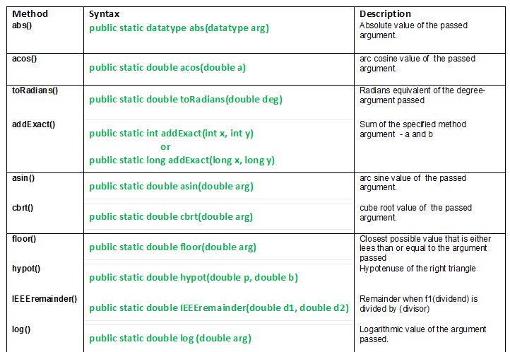
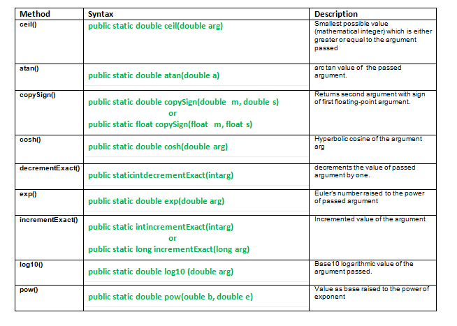
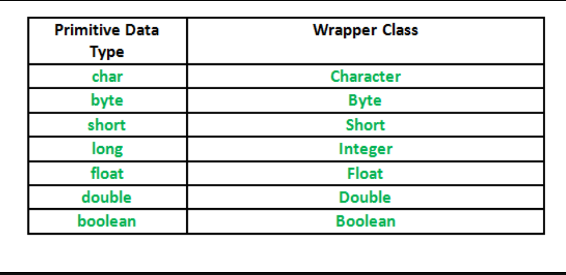

# java.lang.Math Class in Java
Math class method helps to perform the numeric operations like square,square root,cube,cube root,exponential and trignometric operations.







# Wrapper Class and Associated Methods
A wrapper class is a class whose object wraps or contain a primitive data types.When we create an object to a wrapper class,it contains a filed and in this field,we can store a primitive data type.In other words,we can wrap a primitive value into a wrapper class objects.

**Primitive Data types and their corresponding wrapper class**


## Need of Wrapper Classes
- They convert primitive data types into objects.Objects are needed if we wish to modify the arguments passed into a method(because primitive types are passed by value).
- **The classes in java.util packages handles only objects** and hence wrapper classes help in this case also.
- Data structures in the Collection framework,such as ArrayList and Vector stores only objects(reference types) and not primitive types.
- An object is needed to support synchronization in multithreading.


## Number Class
There are mainly six sub-classes under Number class.These sub-classes define some useful methods which is usedful methods which are used frequently while dealing with numbers.
- Byte
- Integer
- Double
- Short
- Float
- Long


###  Methods associated with Double
```
1.) toString(): Returns the string corresponding to the double value.
eg:
double b=55.05;
Double x=Double.valueOf(b);
String s=Double.toString(x);


2.) valueOf(): returns the Double Object initialised with the value provided.
eg:
String s="45.55";
Double d=Double.valueOf(s);


3.) parseDouble(): returns the double value by parsing the string.Differ from valueOf() as it returns a primitive double value and valueOf() return Double object.
eg:
String s="45.45";
Double d=Double.parseDouble(s);

4.) equals(): Used to compare the equlity of two Double objects.This method returns true if both the objects contains same double value.
eg:
if(double1.equals(double2))
//true
else
//false


5.) compareTo(): Used to compare two Double objects for numerical equality.Retuns a value less then 0,0 or greater then 0 for less than,equal to and greater than.
eg:


6.) compare(): Used to compare two primitive double values for numerical equlity.
eg:
if(compare(double1,double2)==0)
//equal


7.) byteValue(): Returns a byte value corresponding to this Double Object:
eg:
byte b=double1.byteValue();


8.) shortValue(): Returns a short value corresponding to this Double Object:
eg:
short s=double1.shortValue();


9.) intValue(): Returns a int value corresponding to this Double Object:
eg:
int i=double1.intValue();


10.) longValue(): Returns a long value corresponding to this Double Object:
eg:
long l=double1.longValue();


11.) doubleValue(): Returns a double value corresponding to this Double Object:
eg:
double d=double1.doubleValue();


12.) floatValue(): Returns a float value corresponding to this Double Object:
eg:
float f=double1.floatValue();
```

### Method Associated with Float
```
a.) toString: Returns the string corresponding to the float value.
eg:
float b=55.05;
Float x=new Float(b);
String s=Float.toString(x);


b.) valueOf(): returns the float object initialised with the value provided.
eg:
String s="23.23";
Float d=Float.valueOf(s);


c.) parseFloat(): returns the float value by parsing the string.Differs from the valueOf() as it returns a primitive float and valueOf() returns the Float object.
eg:
String s="12.23";
Float d=Float.parseFloat(s);


d.) equals(): Used to compare the equlity of the two Float Objects.This methos returns true if both the objects contains same float value.
eg:
if(float1.equals(float2))
//true
else
//false


e.) compareTo(): Used to compare two Float objects for numerical equality.Returns a value less than 0,0,value greater then 0 for less than,equal to and greater than.


f.) compare(): Used to compare two primitive float values for numerical equality.


g.) byteValue(): returns a byte value corresponding to this Float object.
eg:
byte b=float1.byteValue();


h.) shortValue(): returns a short value corresponding to this Float object.
eg:
short s=float1.shortValue();


i.) intValue(): returns a int value corresponding to this Float object.
eg:
int i=float1.intValue();


j.) longValue(): returns a long value corresponding to this Float object.
eg:
long l=float1.longValue();


k.) doubleValue(): returns a double value corresponding to this Float object.
eg:
double d=float1.doubleValue();


l.) floatValue(): returns a float value corresponding to this Float object.
eg:
float f=float1.floatValue();
```

### Methods Associated with Integer
```
a.) toString
b.) toHexString(): returns the string corresponding to the int value in hexadecimal form,that is it returns a string representing the int value in hex characters [0-9],[a-f].
eg:
        int num = 255;
        String hex = Integer.toHexString(num);
        System.out.println("Hex of 255: " + hex); // Output: ff


c.) toOctalString(): returns the string corresponding to the int value in octal form,that is it returns a string representig the int value in octal characters[0-7].
eg:
        int num = 255;
        String octal = Integer.toOctalString(number);
        System.out.println("Octal: " + octal);     // Output: 377


d.) toBinaryString(): returns the string corresponding to the int value in binary digits,that is it returns a string representing the int value in binary characters[0/1].
eg: 
        int num = 255;
        String binary = Integer.toBinaryString(number);
        System.out.println("Binary: " + binary);   // Output: 11111111

e.) valueOf()
f.) parseInt()
h.) getInteger(): returns the Integer object representing the value associated with the given system property or null if it doesnot exist.
eg:
        // Set a system property (for demonstration purposes)
        System.setProperty("myNumber", "123");
        // Fetch system property and convert to Integer
        Integer value = Integer.getInteger("myNumber");
        // Print the result
        System.out.println("Value of 'myNumber': " + value); // Output: 123

        
i.) byteValue()
j.) intValue()
k.) doubleValue()
l.) shortValue()
m.) longValue()
n.) floatValue()
o.) equals()
p.) compareTo()
q.) compare()
```


### Methods Associated with Character
```
a.) boolean isLetter(char ch): This method is used to determine whether the specified char value(ch) is letter or not.This method will return true if it is letter[A-Z],[a-z] else false.
eg:
System.out.println(Character.isLetter('A'));//true
System.out.println(Character.isLetter('0'));//false


b.) boolean isDigit(char ch): This is used to determine whether the specified chat value(ch) is digit or not.
eg:
System.out.println(Character.isDigit('A'));//false
System.out.println(Character.isDigit('0'));//true


c.) boolean isWhitespace(char ch): It determines whether the specified char value(ch) is white space.
eg:
System.out.println(Character.isWhitespace(' '));//true
System.out.println(Character.isWhitespace('A'));//false


d.) boolean isUpperCase(ch)
e.) boolean isLowerCase(ch)
f.) char toUpperCase(ch)
g.) char toLowerCase(ch)
h.) toString(char ch): It returns a String class object representing the specified character value(ch).ie a one-character string.
```

### Methods Associated with Boolean
```
a.) parseBoolean(String s): This method parses the string arguments as a boolean.The boolean returned represents the value true if the string argument is not null and is equal,ignoring case,to the string "true",otherwise returns false.
eg:
boolean b1=Boolean.parseBoolean("True");
Sout(b1);//true

b.) booleanValue(): This method returns the value of this Boolean object as a boolean primitive.
boolean b1=Boolean.booleanValue("True");
Sout(b1);//true

c.) valueOf(boolean b): This method returns a Boolean instance representing the specified boolean value.If the specified boolean value is true,it returns boolean TRUE or if it is false,then this method returns Boolean FALSE.
eg:
boolean b1=true;
Boolean b3=Boolean.valueOf(b1);
Sout(b3);//true

d.) valueOf(String s): This method returns a Boolean with a value represented by the specified string 's'.The Boolean returned represents a true value if the string argument is not null and is equal,ignoring case,to the String "true".

e.) toString(boolean b): This method returns a String object representing the specified boolean.If the specified boolean is true,then the string "true" will be returned,otherwise the string "false" will be returned.

f.) toString(): This method returns a String object representing this Boolean's value.If this object represents the value true,a string equal to "true" is returned.Otherwise,the string "false" is returned.

g.) equals(Object obj): This method returns true if the argument is not null and
 is a Boolean object that represents the same boolean value as this object.

h.) compareTo(Boolean b): This method "compares" this Boolean instance with passed argument 'b'.

i.) compare(boolean x,boolean y): This method is used to compare primitive boolean variables.
```

### Methods Associated with Other Wrapper Class
Same as Double,Float and Interger

# Classes Associated With java.util.Package
## Vector class
The vector class implements a growable array of objects.Vector implements a dynamic array that means it can grow or shrink as required.Like an array,it contains components that can be accessed using an integer index.

### Methods in Vector 
- **add(element)**: This method is used to add elements in vector.
- **get(index)**: This method is used to retrieve elements on the basis of index number.
- **isEmpty()**: This method tests if this vector has no components.
- **remove(index)**: This method removes a single element on the basis of index number.
- **clear()**: This method clears all the elements from vector.
- **size()**: This method returns the number of components in vector.
- **removeAllElements()**: This method removes all components from this vector and sets its size to zero.
- **indexOf(element)**: This method returns the first occurance of given element or -1 is the element is not present in vector.
- **lastIndexOf(element)**: This method returns tha last occurance of given element or -1 if the element is not present in vector.

## Stack Class
Java Collection framework provides a Stack class which models and implements Stack data structure.

### Methods In Stack Class
- **push(element)**
- **pop()**: removes and returns the top element of the stack.An 'EmptyStackException' exception is thrown if we call pop() when the invoking stack is empty.
- **peek()**: returns the element on the top of the stack,but doesnot remove it.
- **empty()**
- **search(element)**: It determines whether an object exists in the stack.If the element is found,it returns the position of the element from the top of the stack.Else,it returns -1.

## Hashtable Class
This class implements a hash table,which maps keys to values.Any non-null object can be used as a key or as a value.

To successfully store and retrieve objects from a hashtable,the objects used as key must implement the hashcode method and the equals method.
- It is similar to HashMap,but is synchronised.
- HashTable stores key/value pair in hash table.
- In hashTable we specify an object that is used as a key,and the value we want to associate with that key.The key is then hashed,and the resulting hashcode is used as the index at which the value is stored within the table.

### Methods in HashTable
- **put(key,index)**
- **get(key)**
- **isEmpty()**
- **remove(key)**
- **clear()**
- **size()**
- **removeAllElements()**: This method removes all components from this hashtable and sets its size to zero.

## Dictinary Class
Dictionary class is an abstract class,representing the key-value relation and works similar to a map.Given a key you can store values and when needed can retrieve the value back using its key.Thus,it is a list of key-value pair.

### Methods in Dictionary
- **put(key,value)**
- **get(key)**
- **isEmpty()**
- **remove(key)**
- **clear()**: This method clear all the elements from dictionary
- **size()**
- **removeAllElement()**: This method removes all components from this Dictionary and sets its size to zero.

# Enumerations in Java
Enumerations serve the purpose of representing a group of named constants in a programming language.For example the 4 suits in a deck of playing cards may be 4 enumerators named club,Diamond,Heart and Spade belonging to an enumerated type named suit.Other examples include natural enumerated types(like the planets,days of the week,colors,directions) etc.

Enum are used when we know all possible values at compile time,such as choices on a menu,rounding modes,command line flags etc.It is not necessary that the set of constants in an enum type stay fixed for all the time.


