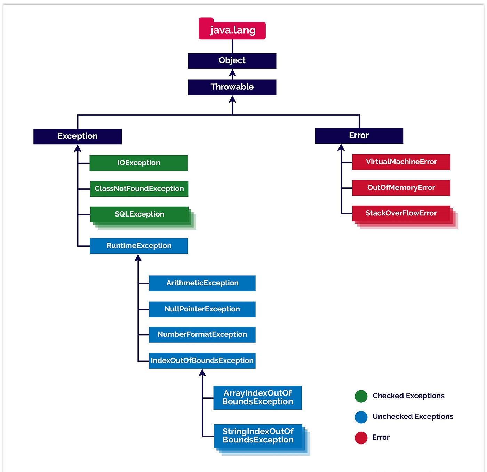

# Exception
An Exception is an unwanted or unexpected event that occurs during the execution of a program (i.e., at runtime) and disrupts the normal flow of the program’s instructions.

# Error Vs Exception
**Error**: An Error indicates a serious problem that a resonable application should not try to catch.

**Exception**: Exception indicates conditions that a resonable application might try to catch.
An exception can occur for many different reasons. Following are some scenarios where an exception occurs:
- A user entered an invalid data.
- A file needed to be opened cannot be found.
- A network connection has been lost in the middle of communications or the JVM has run out of the memory. 

Some of the exceptions are caused by the user error, others by programmers error, and others by physical resources that have failed in some manner.Based on these we have three category of Exceptions. You need to understand them to know how exception handling works in Java.

1. **Checked Exceptions**: A checked exception is an exception that is checked(notified) by the compilier at the compile time, these are also called as compile time exceptions.These exceptions cannot be simply ignored; the programmer should handle these exceptions.
1. **Unchecked Exceptions**: Occurs at the time of execution.These are also called as **Runtime Exceptions**. These include programming bugs, such as logic error or improper use of an API. Runtime exceptions are ignored by at the time of compilation.
1. **Errors**: These are not exceptions at all, but problems that arises beyond the control of the user or the programmer. Errors are typically ignored in your code because you can rarely do anything about an error. for eg:,if an stack overflow occurs, an error will arise. They are ignored at the time of compilation.

# Hierarchy of Java Exception classes
The **java.lang.Throwable** class is the root class of Java Exception hierarchy which is inherited by two subclasses: Exception and Error.A hierarchy of Java Exception classes are given below:

