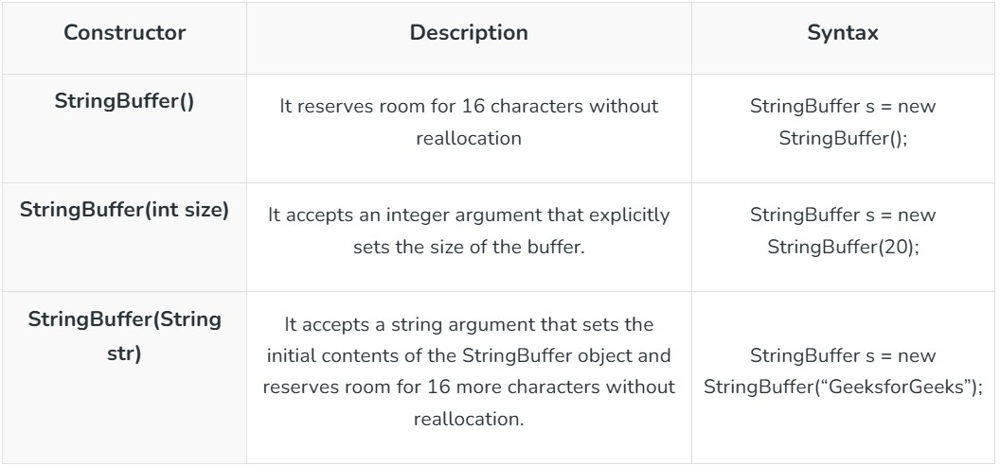
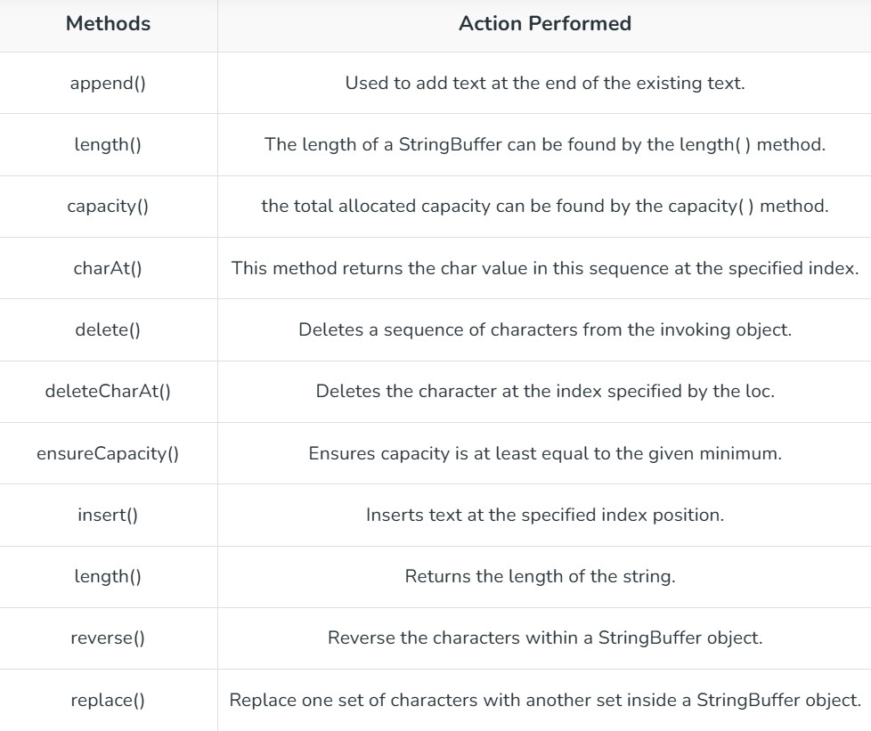

# String Creation
Generally, String is a sequence of characters.But in Java, String is an object that represents a sequence of characters. The **java.lang.String** class is used to create a string object.

In Java, string is basically an object that represents sequence of char values. An array of characters works same as Java string.For eg:
```
char[] ch={'d','a','e','n','i','s','h'};
String s=new String(ch);
is same as:
String s="daenish";
```

There are two ways to create String object:
1. by string literal
1. by new keyword

## String literal
Java string literal is created by using double quotoes.for eg:
```
String s="welcome";
```
Each time you create a string literal, the JVM checks the "string constant pool" first. If the string exists in the pool, a referance to the pooled instance is returned. If the string doesn't exist in the pool,a new string instance is created and placed in the pool. for example:
```
String s1="Welcome";
String s2="Welcome";//It doesnot create a new instance.
```

## By new keyword
String s=new String("Welcome");//Creates 2 objects and one reference variable

## Conversion of String
- Conversion of **any type to String** use,
  - String.valueOf()
  - toString()
- Conversion of **String to any type** use,
  - any_type.parse()

## Changing case of String
The method **toLowerCase()** converts all the characters in a string from uppercase to lowercase. The **toUpperCase()** method converts all the characters in a string from lower to uppercase. Non alphabetical characters such as digits, are unaffected. 

## Character Extraction
### charAt()
To extract a single character from a String, you can refer directly to an individual character via the **charAt()**method. It has general form:
```
char charAt(int where)
```

### getChars()
If you need to extract more then one characters at a time, you can use the **getChars()** method.It has the general form:
```
void getChars(int sourceStart,int sourceEnd,char target[],int targetStart)
```

# String Comparison
There are 3 ways to compare string in java:
- By equals() method
- By == operator
- By compareTo() method

## String compare by equals() method
The String equals() method compares the original content of the string.It compares values of string for equality. String class provides two methods:
- **public boolean equals(Object another)** compares this string to the specified object.
- **public boolean equalsIgnoreCase(String another)** compares this string to another string, ignoring case.

## String compare by compareTo() method
The java string **compareTo()** method compares the given string with current string lexicographically. It returns positive,negative or 0.It compares strings on the basis of Unicode value of each character in the strings.
```
if s1>s2, it returns positive number.
if s1<s2, it returns negative number.
if s1==s2,it returns 0.
```

# Searching Strings
The String class provides two methods that allows you to search a string for a specified character or substring:
- **indexOf()**: searches for first occurance of a character or substring.
- **lastIndexOf()**: searched for last occurance of a character or string.

```
To search for the first occurance of character,use
int indexOf(int ch)

To search for the last occurance of charater,use
int lastIndedOf(int ch)

Here,ch is the character being sought.
```

**To search for the first or last occurance of a substring**,use
```
int indexOf(String str)
int lasIndexOf(String str)

Here,str specifies the substring
```

**You can specify a starting point for the search using these forms**:
```
int indexOf(int ch,int startIndex)
int lastIndexOf(int ch,int startIndex)
int indexOf(String str,int startIndex)
int lastIndexOf(String str,int startIndex)
```

# Modifying a String
## substring()
The **java string substring()** method returns a part of the string.

We pass begin index and end index number position in the java substring method where start index is inclusive and end index is exclusive. In other words, start index starts from 0 whereas end index starts from 1.

There are two types of substring methods in java string.
```
substring(int startIndex)
and 
substring(int startIndex,int endIndex)
```

## Concat()
You can concatenate two strings using **concat()**,shown here:
```
String concat(String str)
```
This method creates a new object that contains the invoking string with the contents of **str** appended to the end.
**concat()** performs the same function as +. for eg,
```
String s1="one ";
String s2=s1.concat("two");
System.out.println(s2);
//Output:one two
```
## replace()
The String replace() method returns a new string after replacing all the old characters/CharSequence with a given character/CharSequence.

There are 2 replace methods in java string.
- replace(char oldChar,char newChar)
- replace(charSequence target,charSequence replacement)

## trim()
Eliminates leadind and trailing spaces. The unicode value of space character is '\u0020'. It checks this unicode value before and after the string,if it exists then removes the spaces and returns the ommited string.

# String Buffer
Java StringBuffer class is used to create mutable(modifiable) string.The StrinfBuffer class is java is same as String class except it is mutable i.e. it can be changed.

## Important Constructors of StringBuffer class


## Important Methods of StringBuffer class



- **StringBuffer append() method**
The append() method concatenates the given argument with this string.

- **StringBuffer insert() method**
The insert() method inserts the given string with this string at the given position.

- **StringBuffer replace() method**
The replace() method replaces the given string from the specified beginIndex and endIndex-1.

- **StringBuffer delete() method**
The delete() method is used to delete the string from the specified beginIndex to endIndex-1.

- **StringBuffer reverse() method**
The reverse() method of the StringBuffer class reverses the current string.

- **StringBuffer deleteCharAt() method**
The Java.lang.StringBuffer.deleteCharAt() is a built-in Java method which removes the char at the specified position in this sequence. So that the sequence is reduced by 1 char.

Syntax:
```
public StringBuffer deleteCharAt(int indexpoint)
```

- **setLength()**
To set the length of the buffer within a StringBuffer object, use **setLength()**. Its general form is shown here:
```
void setLength(int len)
```
Here, **len** specifies the length of the buffer.This value must be non-negative.

- **ensureCapacity()**
If you want to preallocate room for a certain number of characters after a StringBuffer has been constructed, you can use **ensureCapacity** to set the size of the buffer.This is useful if you know in advance that you will be appending a large number of small strings to a StringBuffer.It has this general form:
```
void ensureCapacity(int capacity)
```
here, **capacity** specify the size of buffer

- **length() and capacity()**
The current length of a StringBuffer can be found via **length()** method, while the total allocated capacity can be found through the **capacity** method. They have the following general forms:
```
int length()
int capacity()
```

- **charAt() and setCharAt()**
The value of a single character can be obtained from a StringBuffer via the **charAt()** method. You can set the value of a character within a StringBuffer **using setCharAt().**

