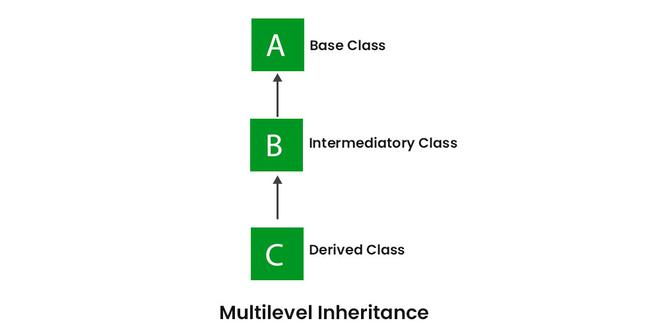
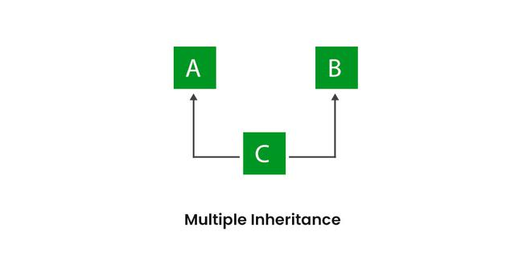
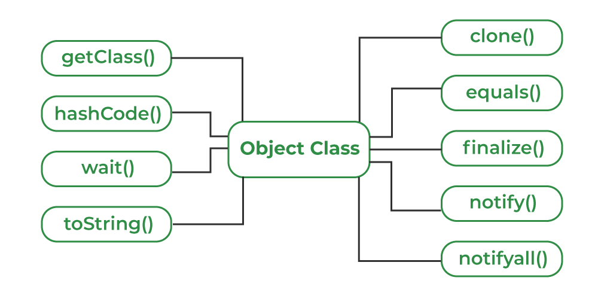

# Introduction
The process by which one class acquires the properties of(data members) and functionalities(methos) of another class is called **inheritance**.
- Aim: Reuseabilty of code,so that a class has to write only the unique features and rest can be extended from the another class.
- Inheritance represents the **IS-A relationship** which is also known as a *parent-child relationship*.
- Inheritance is used in Java for the following.
  - For method Overriding(so run time polymorphism can be achieved).
  - For code reuseabilty.

## Terms used in Inheritance
- **Class**:A class is a group of objects which have a common properties.It is a template or blueprint from which objects are created.
- **Sub Class/Child Class**:It is class which inherits the other class.Also called derived class,extended class or child class.
- **Super Class/Parent Class**:It is the class from where a subclass inherits the features.Also called base class.
- **Reuseability**:It is a mechanism which facilates you to reuse the fields and methods of the existing class when you create a new class.

## The syntax of Java Inheritance
```
class Subclass-name extends Superclass-name
{
    //methods or fields
}
```

The **extends keyword** indicates  that you are making a new class that derives from an existing class.The meaning of **extends** is to *increase the functionality*.

# Types of inheritance in Java
- On the basis of class,there are 3 types of inheritance in Java:
  - single
  - multilevel
  - hierarchical

In java,**multiple and hybrid inheritance** is supported through **interface only**.

## Single Inheritance

```
public class A
{
    ...
}
public class B extends A
{
    ...
}
```

## Multilevel Inheritance

```
public class A {...}
public class B extends A{...}
public class c extends B{...}
```

## Hierarchical Inheritance

```
public class A {...}
public class B extends A {...}
public class C extends A {...}
public class D extends A {...}
```

## Multiple Inheritance

```
public class A {...}
public class B {...}
public class extends A,B {...}//Java does not support
```

## Hybrid Inheritance

```
Java does not support.
```

# Super Keyword
The **super** keyword in java is a reference variable that is used to refer parent class objects.It is used in following contexts:
- Use of super with variables. 
- Use of super with methods.
- Use of super with constuctors.

Example code:
```
//Parent class
class Vechile
{
 String name="BMW";
 Vechile()
 {
    System.out.println("This is a default constructor of vechile");
 }
 void method1()
 {
    System.out.println("This is the method 1 of parent class");
 }
 void method2()
 {
    System.out.println("This is the method2 of parent class");
 }
}

//Child class
class Car extends Vechile
{
   String name="Farrari";
   void method1()
   {
    System.out.println("This is the method1 of Child class");
   }
   void displayDetails()
   {
    System.out.println("Using name of Parent class"+super.name);
    this.method1();
    super.method1();
   }

}

public class Practice {
    public static void main(String[] args) {
        Car obj=new Car();
        obj.displayDetails();
    }
}
```

# Dynamic Method Dispatch
- Mechanism by which a call to an overridden method is resolved at runtime,rather than compile time.
- It is important beacuse this is how Java implements run-time polymorphsism.
- Advantages:
  - loose coupling can be achieved.
    - It can be achieved in:
      - Abstract classes
      - Interfaces

# Object Class in Java
- It is present in **java.lang package**.
- Every class in Java is directly or indirectly derived from it.
- Hence,the Object class acts as a root of the inheritance hierarchy in any java program.
## Object class methods



# Final Class
The keyword final has 3 uses.First, it can be used to create the equivalent of a named constant. The other 2 uses of final apply to inheritance.
## Using final to Prevent Overriding
Methods declared as final cannot be overridden.
## Using final to prevent inheritance
Declaring a class as final implicitly declares all of it's methods as final too.


# Package
- A **java package** is a group of similar types of classes,interfaces and sub-packages.
- Categorized into 2 forms:**build-in and user defined package**.
- There are many build-in packages such as:**java,lang,awt,javax,swing,net,io,util,sql** etc.
## Advantages of Java Package
- Used to categorize the classes and interfaces so they can be easily maintained.
- Provides access protection.
- Removes naming collision.
The **package** keyword is used to create a package in Java


There are three ways to access the package from outide the package.
- import package.*;
- import package.classname;
- fully qualified name.


 If you use package.* ,then all tha classes and interfaces of this package will be available but not subpackages.
 The import keyword is used to make the classes and interfaces of other package accessible to the current package.

### Subpakage in Java
Package inside the package is called the **subpackage**.
```
package java.util.Scanner;
class Simple
{
  puplic static void main(String[] args)
  {
    Scanner scan=new Scanner(System.in);
    System.out.println("Enter a number: ");
    int a=scan.nextInt();
    System.out.println("Inputted number is:" +a);
  }
}
```

# Interface in Java
Like a class, an interface can have methods and variables,but the methods declared in interface are by default abstract(only method signature, no body).
- Interface specify what a class must do and not how. It is the blueprint of class.
- An interface is about capabilites like a Player may be an interface and any class implementing Player must be able to(or must implement) move(). So it specifies a set of methods that the class has to implement.
- If a class implements an interface and doesnot provide method bodies for all functions specified in the interface, then class must be declared abstract.
Syntax:
```
interface interface_name
{
  declare constant fields
  declare methods that abstract by default 
}
```
To declare an interface, use **interface** keyword. It is used to provide total abstraction.That means all the methods in interface are declared with empty body and are public and all fields are public, static and final by default.A class that implement interface must implement all the methods declared in the interface.

## Why to use interface?
- It is used to achieve total abstraction.
- Since, java doesnot support multiple inheritance in case of class, but by using interface it can achieve multiple inheritance.