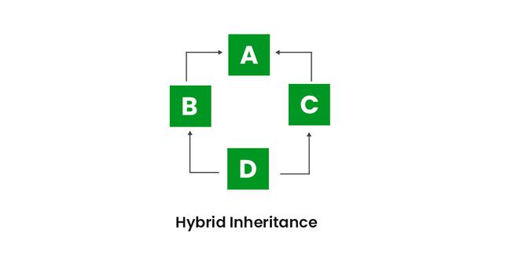

# Introduction
The process by which one class acquires the properties of(data members) and functionalities(methos) of another class is called **inheritance**.
- Aim: Reuseabilty of code,so that a class has to write only the unique features and rest can be extended from the another class.
- Inheritance represents the **IS-A relationship** which is also known as a *parent-child relationship*.
- Inheritance is used in Java for the following.
  - For method Overriding(so run time polymorphism can be achieved).
  - For code reuseabilty.

## Terms used in Inheritance
- **Class**:A class is a group of objects which have a common properties.It is a template or blueprint from which objects are created.
- **Sub Class/Child Class**:It is class which inherits the other class.Also called derived class,extended class or child class.
- **Super Class/Parent Class**:It is the class from where a subclass inherits the features.Also called base class.
- **Reuseability**:It is a mechanism which facilates you to reuse the fields and methods of the existing class when you create a new class.

## The syntax of Java Inheritance
```
class Subclass-name extends Superclass-name
{
    //methods or fields
}
```

The **extends keyword** indicates  that you are making a new class that derives from an existing class.The meaning of **extends** is to *increase the functionality*.

# Types of inheritance in Java
- On the basis of class,there are 3 types of inheritance in Java:
  - single
  - multilevel
  - hierarchical

In java,**multiple and hybrid inheritance** is supported through **interface only**.

## Single Inheritance

```
public class A
{
    ...
}
public class B extends A
{
    ...
}
```

## Multilevel Inheritance

```
public class A {...}
public class B extends A{...}
public class c extends B{...}
```

## Hierarchical Inheritance

```
public class A {...}
public class B extends A {...}
public class C extends A {...}
public class D extends A {...}
```

## Multiple Inheritance

```
public class A {...}
public class B {...}
public class extends A,B {...}//Java does not support
```

## Hybrid Inheritance

```
Java does not support.
```

# Super Keyword
The **super** keyword in java is a reference variable that is used to refer parent class objects.It is used in following contexts:
- Use of super with variables. 
- Use of super with methods.
- Use of super with constuctors.

Example code:
```
//Parent class
class Vechile
{
 String name="BMW";
 Vechile()
 {
    System.out.println("This is a default constructor of vechile");
 }
 void method1()
 {
    System.out.println("This is the method 1 of parent class");
 }
 void method2()
 {
    System.out.println("This is the method2 of parent class");
 }
}

//Child class
class Car extends Vechile
{
   String name="Farrari";
   void method1()
   {
    System.out.println("This is the method1 of Child class");
   }
   void displayDetails()
   {
    System.out.println("Using name of Parent class"+super.name);
    this.method1();
    super.method1();
   }

}

public class Practice {
    public static void main(String[] args) {
        Car obj=new Car();
        obj.displayDetails();
    }
}
```

## Single Inheritance 


# Dynamic Method Dispatch
- It is the type of overide.
- It is used also known as Runtime polymorphism.
- mechanism in java where the method call is resolved at runtime rather than at compile time.
- Advantages:
  - loose coupling can be achieved.
    - It can be achieved in:
      - Abstract classes
      - Interfaces
