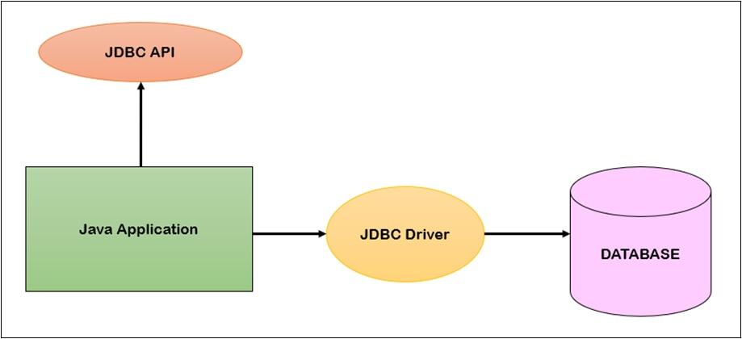
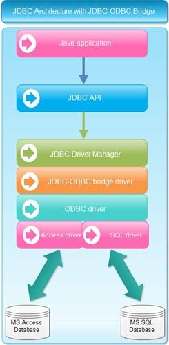

# Java Database Connectivity
JDBC stands for **Java Database Connectivity**.JDBC is a Java API to connect and execute the query with the database.It is part of **JavaSE(Java Standard Edition)**.JDBC API uses JDBC drivers to connect with the database.There are 4 types of JDBC drivers:
- JDBC-ODBC Bridge Driver
- Native Driver
- Network Protocal Driver
- Thin Driver

We can use JDBC API to access tabular data stored in any relational database.By the help of JDBC API,we can save update,delete and fetch data from the database.It is like **Open Database Connectivity(ODBC)** provided by Microsoft.

# JDBC-ODBC Bridge
Microsoft's ODBC is the most commonly used driver to connect to the database as it can connect to almost all databases on most of the platforms.However,ODBC uses the concept of pointers and other constructs that are not supported by java.

Therefore,JDBC-ODBC bridge driver was devloped which translates the JDBC API to the ODBC API and vise-versa.This bridge acts as interface which enables all DBMS which support ODBC to interact with Java Applications.JDBC-ODBC bridge is implemented as a class file and a native library.The name of the class file is **JdbcOdbc.class**.

