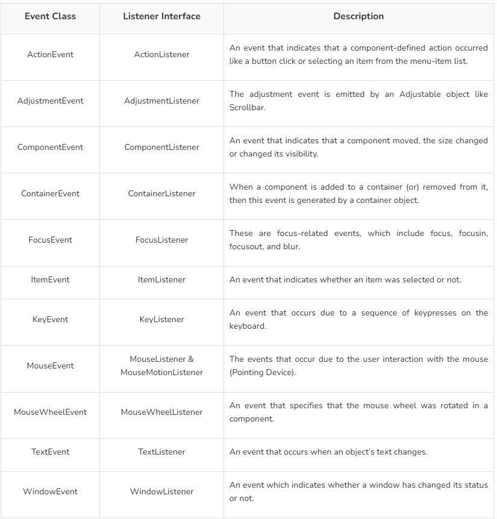

# About AWT and Swing
AWT and Swing both are used to create GUI interface.Both are used to perform  almost same work,still they differ from each other.Following are the differences between AWT and Swing.

## AWT
- Stands for **Abstract Window Toolkit**.
- **Components are heavy weight**.
- Components are **platform dependent** so,**there look and feel changes according to OS**.
- Components are not very good in look and feel as compared to Swing components.
- Limited set of components.

## Swing
- It is a part of **Java Foundation Class(JFC)**.
- Components are **light weight**.
- Components are **platform independent** so,**there look and feel remains constant**.
- Components are better in look and feel as compared to AWT.
- Has more and powerful components.

### JFrame
Whenever you create a graphical user interface with Java Swing functionality,you will need a container for your application. In case of Swing ,this container is called a Jframe. All GUI application requires a JFrame.

**Why to use JFrame?**

We cannot build a house without the foundation. The same is true in Java: Without a container in which to put all other elements,you won't have a GUI application.

> Note: Light-weight: mean's that donot take up much space or use many system resources.

This class has it's own methods and constructors that impact the Jframe,such as **setSize(),setVisible()** etc.

### JPanel in Swing
- It is a simplest container class.
- It provides space in which an application can attach any other components.
- It **inherits the JComponents class**.
- It **doesnot have title bar**.

# Swing Components and Containers
A component is an independent visual control.**All components are derived from the JComponent class**.This class provides some common functionality like pluggable look and feel,support for accessibilty,drag and drop,layout etc.

A container holds a group of components.It provides a space where a components can be managed and displayed.Container are of two types:
- **Top level Containers**
  - It **inherits component and container of AWT**.
  - It **cannot be contained within other containers**.
  - Heavy weight.
  - eg: JFrame,JDialog,JApplet.

- **Lightweight Containers**
  - It **inherits JComponents class**.
  - It is a general purpose conatainer.
  - Used to organize related components together.
  - eg: JPanel.

### JButton
JButton is in implementation of a push button.It is used to trigger an action if ther user clicks on it.It can display a text,an icon or both.

### JLabel
Label is a simple component for displaying **text,images or both**.It doesnot react to input events.

### JTextField
JTextField is a text component that allows editing of a single line of non-formatted text.

### JCheckBox
JCheckBox is a box with a label that has two states:on or off.If the check box is selected,it is represented by a tick box.**A checkbox can be used to show or hide a splashscreen at stratup,toggle visibilty of a toolbar** etc.

### JComboBox
JComboBox is a component that **combines a button or editable field and a drop-down list**.The user can select a value from the drop-down list,which appears at the user's request.If you make the combo box editable,then the combobox includes an editable field into which the user can type a value.

**Example:**
```
 String arr[]={"MCA","BBA","BCA","MBA"};
 JComboBox cmb=new JComboBox(arr);

 //or

 JComboBox<String> cmb=new JComboBox<String>();
 cmb.addItem("MCA");
 cmb.addItem("BBA");
 cmb.addItem("BCA");
 cmb.addItem("MBA");
```

### JList
It is a component that displays a list of objects.It allows the user to select one or more items.

**Example:**
```
String arr[]={"MCA","BBA","BCA","MBA"};
JList cmb=new JList(arr);
```

### JTextArea
A JTextArea is a multiline text area that displays plain text.It is a light-weight component for working with the text.The component doesnot handle scrolling.For this task,we use **JScrollPane** component.

### JTable
The JTable class is a **part of Java Swing Package** and is generally used to display or edit two dimensional data that is having both rows and columns.It is similar to a spreadsheet.This arranges data in tabular form.

### JMenu
- The JMenu class is used to display menubar on the window or frame.It may have several menus.
- The object of JMenu class is a pulldown menu component which is displayed from the menubar.
- It inherits the JMenuItem class.
- The object of JMenuItem class adds a simple labeled menu item. The items used in a menu must belong to the JMenuItem or any of its subclass.

# Dialog Boxes in Swing
Dialog windows or dialogs are an indispensable(absolutely necessary) part of the most mordern GUI applications.In a computer application a dialog is a window which is used to "talk" to the application.A dialog is used to input data,modify data,change the application settings etc.

In Java Swing,we can create two types of dialogs: **standard dialogs and custom dialogs**.
- **Custom Dialogs**: Are created by programmers.They are **based on the JDialog class**.
- **Standard Dialogs**: Predefined dialogs available in the Swing toolkit,for eg: **JColorChooser,JFileChooser**.

## Modal and Modeless Dialog
There are two basic types of dialogs: **modal and modeless**.Modal dialogs block input to other top-level windows.Modeless dialogs allow input to other windows.An open file dialog is a good example of a modal dialog.While choosing a file to open,no other operation should be permitted.A typical modeless dialog is a find text dialog.It is handy to have the ability to move the cursor in the text control and define,where to start the finding of the particaular text.

### Standard Dialog Example-Message Box
```
 JOptionPane.showMessageDialog(null,"Hello world");
```

### Custom Dialog Creation
```
JDialog jd=new JDialog();
jd.setTitle("This is a Test Dialog");
JLabel lbl=new JLabel("Do you want to exit");
jd.add(lbl);
JButton yes=new JButton("Yes");
jd.add(yes);
```

# Layout Management
In Java Swing,Layout manager is used to position all its components,with setting properties such as : size,shape and the arrangement.
Following are the different types of layout managers:
- Flow Layout
- Border Layout
- Grid Layout

## Flow Layout
The Flow Layout arranges the components in a directional flow,either from left to right,or from right to left.Normally all the components are set to one row,according to the order of different components.If all components cannot fit into one row,it will start a new row and fit the rest in it.

## Border Layout
A BorderLayout lays out a container ,arranging its components to fit into five regions:**NORTH,SOUTH,EAST,WEST and CENTER**.For each region,it may contain more than one component.

For BorderLayout,it can be constructed like below:
- **BorderLayout()**: construct a border layout with no gaps between components.
- **BorderLayout(int hgap,int vgap)**: construct a border layout with specified gaps between components.

## Grid Layout
The GridLayout manager is used to lay out the components in a rectangle grid,which has been divided into equal-sized rectangles and one component is placed in each rectangle.

It can be constructed with following methods:
- **GridLayout():** construct a grid layout with one column per components in a single row.
- **GridLayout(int row,int col):** construct a grid layout with specified number of rows and columns.
- **GridLayout(int row,int col,int hgap,int vgap):** construct a grid layout with specified rows,columns and gaps between components.


# MDI using JDesktop Pane and JInternal Frame
MDI-**Multi Document Interface**

The JDesktopPane class,can be used to create "multi-document" applications.A multi-document application can have many windows in it.The JDesktopPane is a container which is used to create a multiple-document interface or a virtual desktop.The JFrame inside the desktop becomes JInternalFrame.JInternalFrame is used just like the JFrame but is added to JDesktopPane object.

# Event Handling 
Event describes the change in state of any object.For example: pressing a button,entering a character in TextBox,clicking or dragging a mouse etc.

It has three main components:
- **Events**: An event is a change in state of an object.
- **Event Source**: It is an object that generates an event.
- **Listeners**: A listener is an object that listens to the event.A listerner gets notified when an event occurs.

## How events are handled?
A source generates an Event and send it to one or more listeners registered with the source.Once event is received by the listerner,they process the event and return.Events are supported by a number of Java packages,like: **java.util,java.awt** and **java.awt.event**.

### Important Event Classes and Interface


### Example of ActionListener
```
JButton btn=new JButton("Click Here");
btn.addActionListener(new ActionListener()
{
  public void actionPerformed(ActionEvent e)
  {
    //event handling code here
  }
});
```

### Example of ItemListener
```
JComboBox cmb=new JComboBox(arr);
cmb.addItemListener(new ItemListener()
{
  public void actionPerformed(ItemEvent e)
  {
    if(e.getStateChange()==ItemEvent.SELECTED)
    {
      //event handling code
    }
  }
})
```

## Keyboard and Mouse Events
The Java **MouseListener** is notified whenever you change the state of the mouse.It is notified against MouseEvent.The MouseListener interface is found in **java.awt.event** package.It has 5 methods:
- void mouseClicked(MouseEvent e);
- void mouseEntered(MouseEvent e);
- void mouseExited(MouseEvent e);
- void mousePressed(MouseEvent e);
- void mouseReleased(MouseEvent e);

The Java **KeyListener** is notified whenever you change the state of key.It is notified against KeyEvent.The KeyListener interface is found in java.awt.event package.It has three methods:
- void keyPressed(KeyEvent e);
- void keyReleased(KeyEvent e);
- void keyTyped(KeyEvent e);
