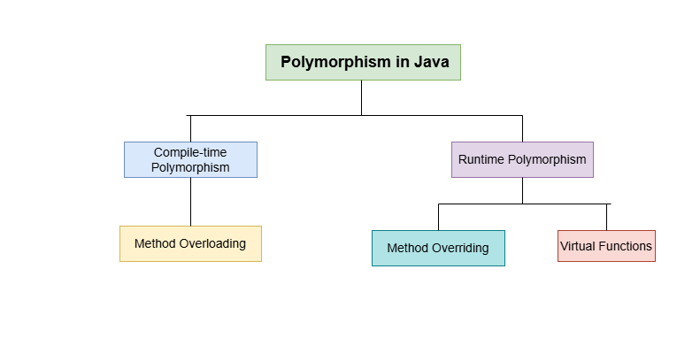

# Fundametals of class 
Class are the templates that are used to crete objects,and to define the objects data types and methods.A class is a user defined blue print or prototype from which objects are created.
Class(blue print of an object)
```
Syntax:
class ClassName(classNameAlways start from capital letter)
{
    " Data members
    " methods
}
eg:
class Student
{
    String name;
    Srring address;
    void details()
    {
        System.out.print(name+address);
    }
}

//Creating object
Student student=new Student();
student.details();

```
object(instance of class)

### Features of OOP
- Abstraction:chahina cheeze matra dekhauna.
- polymorphism:many form.
- inheritance
- encapsulation
- classes and object
- modularity

# Constructor
A *constructor* in Java is a block of code similar to method that's is called when an instance of object is created.Here are difference between constructor and method:
- A constructor doesnot have return type.
- The name of constructor must be same as the name of the class.
- Unlike,methods constructor are not considered as member of class.
- A constructor is called automatically when a new instance of an object is created.

> Note: All classes have constructor whether you define or not,because Java automatically provide's a default constructor that initializes all members variables to zero.There are 2 types of constructor Default constructor and Parameterized Constructor.

Syntax of Constructor:
```
class Classname
{
    Classname()
    {

    }
}
```
## Default Constructor
The *default constructor* is a constructor that is automatically generated in the absence of explicit constructor(i.e user defined constructor).Sometimes also called *nullary* constructor.

## Parameterized Constrcutor
The constructor which has parameters or arguments is known as parameterized constructor.The values of arguments are assigned to data members of the class.

## The this keyword
Keyword *this* is a reference variable in Java that refer's to the current object.The various uses of this keyword are as follow:
- It can be used to refer the instance variable of current class.
- It can be used to invoke or initiate current class constructor.
- It can be used as an argument in the method call.
- It can be used as argument in the constructor call.
- it can be used to return the current class instance.

Sometimes a method will need to refer to the object that invoked it.To allow this,Java defined *this* keyword.*this* can be used inside any method to refer to the current object.That is ,*this* is always a refernce to the object on which the method was invoked.You can use 
*this* anywhere a reference to an object of the currenr class type is permitted.

# Four main features of Object Oriened Programming
- Abstraction
- Encapsulation
- Polymorphism
- Inheritance

## Abstraction
It is a process of hiding the implementation details from the user,only the functionality will be provided to the user.In Java,abstraction
is achieved using Abstract classes and interfaces.

### Abstract class
A class which contains the **abstract** keyword in its declaration is known as abstract class.
- Abstract classes may or maynot contain abstract methods i.e, methods without body(public void get();)
- But,if a class has at least one abstract method,then the class must be declared abstract.
- If a class is declared abstract,it cannot be instantiated(we cannot create an object).
- To use an abstract class,you have to inherit it from another classs,provide implementations to abstract methods in it.
- If you inherit an abstract class,you have to provide implementations to all the abstract methods in it.

## Encapsulation
Encapsulation in Java is a mechanism of wrapping the data(variables) and code acting on data(methods) together as a single unit.In Encapsulation,the variables of a class will be hidden from other classes, and can be accessed only through the methods of their current class.

To achieve encapsulation in Java:
- Declare the variables of a class as private.
- Provide **public setter and getter** methods to modify and view the variables values.

Benifits of Encapsulation
- A fields of class be made read-only or write only.
- A class can have total control over what is stored in it's fileds.

### Code to demonstrate use of Encapsulation
```
class Test
{
    private String name;
    private int age;

    public String getname()
    {
        return name;
    }

    public int getage()
    {
        return age;
    }

    public void setname(String nm)
    {
        name=nm;
    }

    public void setage(int ag)
    {
        age=ag;
    }
}

public class Encapsulation {
    public static void main(String[] args) {
        Test obj=new Test();
        obj.setname("Daenish");
        obj.setage(21);

        System.out.println("Name: "+obj.getname());
        System.out.println("Age: "+obj.getage());
    }
}

```
Here,we cannot access private data members name and age directly.So we have to create public getter and setter methods to access the private data members.

## Polymorphism
Polymorphism in Java is a concept by which we **can perform a single action in different ways**.Polymorphism is derived from 2 Greek words:poly[many] and morphs[forms].There are 2 types of polymorphism in java:**compile-time polymorphism** and **run time polymorphism**.
We can perform polymorphism in java by **method overloading and method overriding**.


## Method Overloading
Method Overloading is a feature that allows a class to have more then one method having the same name,if their argument list are different.It is similar to constructor overloading in Java,that allows a class to have more then one constructor having different lists.
In order to overload a method,the argument lists of the methods  must differ in either of these:
- Number of parameters:
  - add(int,int)
  - add(int,int,int)
- Data type of parameters:
  - add(int,int)
  - add(int,float)
- Sequence of Data type of parameters:
  - add(int,float)
  - add(float,int)
### Code to demonstrate the use of Method Overloading.
```
class Overload
{
    void demo(int a)
    {
        System.out.println("a: "+a);
    }
    void demo(int a,int b)
    {
        System.out.println("a and b: "+a+" "+b);
    }
    double demo(double a)
    {
        System.out.println("double a: "+a);
        return a*a;
    }
}
public class MethodOverloading {
    public static void main(String[] args) {
        Overload obj=new Overload();
        double result;
        obj.demo(10);
        obj.demo(20, 30);
        result=obj.demo(7.7);
        System.out.println("O/P: "+result);
        
    }
}
```
Here the method **demo()** is overloaded 3 times:first method has **1 int** paramter,second method has **2 int** parameters and third one is having double parameter.Which method is to be called is determined by the arguments we pass while calling methods.This happens at the compile time so this type of polymorphism is called **compile time polymorphism**.

## Method Overriding
Declaring a method in **sub class**  which is already present in **parent class** is known as method overiding.Over riding is done so that a child class can give it's own implementation to a method which is already provided by the parent class.In this case the method in parent class is called overridden method and the method in child class is called overriding class.
### Code to demonstrate the use of overriding
```
public class Human {//Parent class
    //Overridden method
    public void eat()
    {
        System.out.println("Human is eating.");
    } 
}

class Boy extends Human
{
    //Overriding method

    public void eat()
    {
        System.out.println("Boy is eating");
    }
    public static void main(String[] args) {
        Boy obj=new Boy();
        //This will call the child class version of eat()
        obj.eat();
    }
}
```

## Rules of method overriding in Java
1.) **Arguments list**:The argument list of overriding method(method of child class) must match the Overridden method(the method of parent class).The data types of the arguments and their sequence should exactly match.

2.) **Access Modifier** of the overriding method(method of subclass) cannot be more restrictive than the Overridden method of parent class.For eg: if the Access modifier of of parent class method is public then overriding method(child class method) cannot be private,
protected and default Access modifier,because all of these three access modifier are more ristricter than public.
### Code to demonstrate the use of method Overriding
```
//Animal.java file ma lakhna 
public class Animal {
    public void sound()
    {
        System.out.println("Animal is making sound");
    }
}
//Horse.java file ma lakhna
class Horse extends Animal
{
    @Override
    public void sound()
    {
        System.out.println("Neigh");
    }
    public static void main(String[] args) {
        Animal obj=new Horse();
        obj.sound();
    }
}
```

## Introducing Nested and Inner Classes
It is possible to define a class within another class;such classes are known as nested classes.The scope of a nested class is bounded by the scope of its enclosing class.However,the enclosing class doesnot have access to the members of the nested class.
```
class Outer
{
    private String outerfiled="Outer class field";

    //Nested class
    class Inner
    {
        private String innerfield="Inner class field";
        void display()
        {   
            //Inner class can access members of the outer class 
            System.out.println("Accessing outer field: "+outerfiled);
        }
    }

    void show()
    {
        //Outer class cannot directly access inner class members
        Inner obj=new Inner();
        obj.display();
        // System.out.println(obj.innerField); // This would cause a compilation error
    }

    public static void main(String[] args) {
        Outer myouter=new Outer();
        myouter.show();
    }
}
```

There are 2 types of nested classes:static and non-static class.A static nested class is the one that has the static modifier applied.Because it is static,it must access the members of enclosing class throught an object,canont refers to the members of enclosing class directly.
```
class Outer
{
    private String outerfield="Outer Instance Field";
    private static String staticOuterfield="Outer static field";

    //Static nested class
    static class StaticInner
    {
        void display()
        {
            //Cannot access non-static members directly
             // System.out.println(outerField); // ❌ Compilation error

             //Can access the static members of the outer class
             System.out.println("Accessing staic outer field: "+staticOuterfield);
        }

        void displayWithOuterInstance(Outer outer)
        {
            //Accessing non-static member through the instace od Outer
            System.out.println("Accessing outer instance field: "+outer.outerfield);
        }
    }

    public static void main(String[] args) {
        StaticInner inner=new StaticInner();
        inner.display();

        //Creating an instance of the outer class to access non-static members
        Outer outer=new Outer();
        inner.displayWithOuterInstance(outer);
    }
}
```

The most important type of nested class is the inner class.An inner class is non-static nested class which has access to all the variables and methods of its outer class and may refer to them directly.
```
 class Outer {

    int outer_x=100;

    void test()
    {
        Inner inner=new Inner();
        inner.display();
    }

    //This is a inner class
    class Inner
    {
      void display()
      {
        System.out.println("Display: outer_x: "+outer_x);
      }
    }

    public static void main(String[] args) {
        Outer outer=new Outer();
        outer.test();
    }
}
```

## Static Keyword
It is used to call the attributes or method without creating the objects.
```
public class StaticKeyword {
 String employeename;
 static String employeeCEO;
 double employeesalary;

 void display()
 {
    System.out.println("Employee name: "+employeename);
    System.out.println("Employee CEO: "+employeeCEO);
    System.out.println("Employe salary: "+employeesalary);
 }

 public static void main(String[] args) {
    StaticKeyword obj1=new StaticKeyword();
    StaticKeyword obj2=new StaticKeyword();

    //Static data initialization
    StaticKeyword.employeeCEO="Daenish";

    obj1.employeename="Ayush";
    obj1.employeesalary=12000;
    obj1.display();

    obj2.employeename="Ashik";
    obj2.employeesalary=20000;
    obj2.display();
 }
}
```then

### @override
It is the condition where child class re-implement the method of parent class.


class Arith..
    addTwoDigit(int a, int b){}

class add.. extends Arith..{

}


clss Main{
    main(){
        add a= new add();
        a.addTwoDigit(4,6);
    }
}