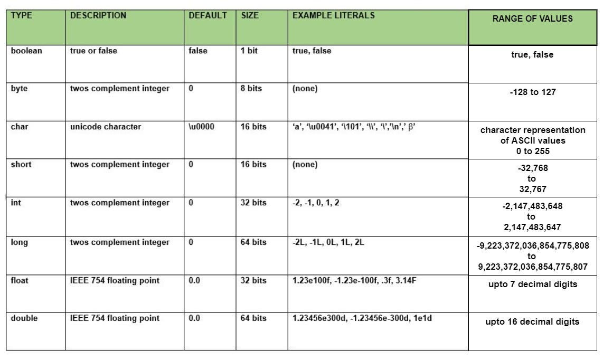

# Tokens,Expressions and Control Structures[Unit 2]
## Primitive Data Types
- Most basic data types available within the Java Language.
- 8 primitive data types:boolean,byte,char,short,int,long,float and double.
- Serves only one purpose-containing pure,simple values of a kind.
- Are defined into the system by default ,they come with a number of operations predefined.



Data types are divided into 2 groups:
- Primitive data types:boolean,byte,char,short,int,long,float and double.
- Non-primitive data types:These datatypes refer's to objects or arrays.
## Non-primitive data types:
```
        //1.)String:Sequence of characters.
        String collageName="Nepathya collage";
        System.out.println(collageName);

        //2.)Array:Collection of elements with same data type
        int[] arrayOfNumbers={1,2,3,4,5};
       // System.out.println(arrayOfNumbers);
        System.out.println(Arrays.toString(arrayOfNumbers));

        //3.) Class:Instance of an object

        //4.) Enum:Constant values in object(e.g dropdown in Gender field)
```
## User Defined Data Types
User defined data types are those that user/programmer himself defines.for e.g:
```
MyClass obj
Here obj is a variable of data type MyClass and we call them reference variable as they can be used to store the
reference to the object of that class.
```
## Type Conversion and Casting
Conversion of one data type to another data type is called **type casting**.
### Java's Automatic Conversion
When one type of data is assigned to another type of variable,an automatic type conversion will take place if the following two condition's are met:
- The two types are compatible(eg:assigning an **int** value to a **long** variable).
- The destination type is larger then the source type.
## Casting Incompatible Types
To create a conversion between two incompatible types,you must use a cast.A case is simply an explicit type conversion.It has this general form.*(target-type)value*.
```
//Demonstrate cast
public class Conversion {
    public static void main(String[] args) {
        byte b;
        int i=257;
        double d=323.142;

        System.out.println("\nConversion of int to byte");
        b=(byte)i;
        System.out.println("i and b: "+i+" "+b);

        System.out.println("\nConversion of double to int");
        i=(int)d;
        System.out.println("d and i: "+d+" "+i);

        System.out.println("\nConversion of double to byte.");
        b=(byte)d;
        System.out.println("d and b: "+d+" "+b);
    }
}
```
## Garbage Collection
Java garbage collection is the process by which Java programs performs automatic memory management. Java programs compile to byte code that can be run on a JVM.When Java programs run on the JVM,objects are created on the heap,which is the portion of memory dedicated to the program.Eventually,some object's will no longer be needed.The garbage collector find's these unused objects and deletes them to free up memory.

Generally,an object become eligible for garbage collection in Java on following cases:
- All reference to that object explicitly set to null eg: object=null.
- The object is created inside a block and reference goes out scope once control exit that block.
- Parent object set to null if an object hold the reference to another object and when you set container object's reference to null,child or contained object automatically becomes eligible for garbage collection.

# Control Statements 
A programming languages uses control statements to cause the flow of execution to advance and branch based on changes to the state of a prorgam.Java's program control statement can be put into the following categories:
*selection,iteration and jump.*

### Java's Selection Statements
Java supports two selection statements:if and switch.These statements allows you to control the flow of your program's execution based upon condition's known only during run time.
1.) if statement
```
syntax:
if(condition)statement1;
else statement2;
```

2.) Nested if statement

```
syntax:
if (condition)
statement1;

else if(condition)
statement2;

else if(condition)
statement3;

else
statement4;
```

3.) Switch Statement
```
syntax:
switch(expression)
{
    case value1:
    //statement sequence
    break;

    case value2:
    //statement sequence
    break;

    case value3:
    //statement sequence
    break;

    case valueN:
    //statement sequence
    break;

    default:
    default statement sequence
}
```

### Java's Iteration Statements
Java's iteration statements are *for,while and do-while*.A loop repeatedly execute's the same set of instructions until a termination condition is met.A loop statement allows you to execute a statement or group of statements multiple times.

1.) **for loop:**A *for loop* is useful when you know how many time's a task is to be repeated.
```
syntax:
for(initialization;boolean_expression;update)
 {
    //statements
 }
```
2.) while loop:A while loop statement in Java programming language repeately executes a target until statement as long as a given condition is true.
```
syntax:
while(Boolean expression)
{
    //statements
}
```
3.) do-while loop:A do-while loop is similar to a while loop,except that a do-while loop is guarented to execute at least one time.
```
syntax:
do
 {
    //statement
 }while(Boolean_expression);
```
# Jump Statements
Java Supports three jump statements:break,continue and return.These statements transfer control to another part of your program.

### Using break 
In Java,the break statement has three uses:
- It terminates a statement sequence in a switch statement.
- It can be used to exit a loop.
- It can be used as "civilized" form of goto.

### Using continue

