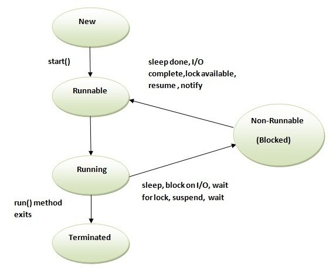
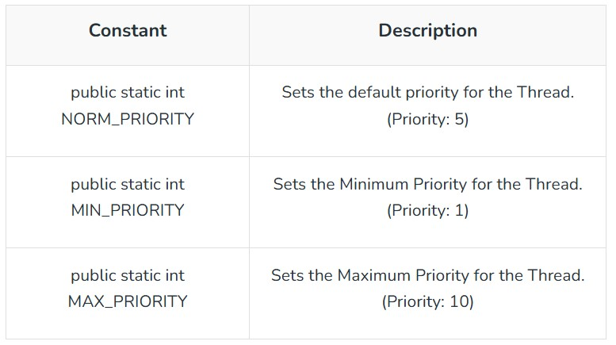
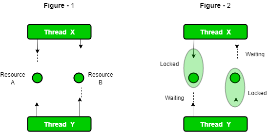

Multithreading is a java feature that allows concurrent execution of two or more parts of a program for maximum utilization of CPU.Each part of such program is called thread and each thread defines seperate path of execution. so threads are light-weight processes within a process.so, multithreading is a specialized form of mutitasking.

## The Java Thread Model
The Java run-time system depends on threads for many things. Threads reduces the inefficiency by prevention the waste of CPU cycles.

Theads exits in several states.
- **New**: When we create an instance of Thread class, a thread is in a new state.
- **Running**: The java thread is in running state.
- **Suspended**: A running thred can be **suspended**, which temporarily suspends its activity. A suspended thread can be resumed, allowing it to pick up where it left off.
- **Blocked**: A Java thread can be blocked when waiting for a resource.
- **Terminated**: A thread can be terminated, which halts its execution immediately at any given time. Once a thread is terminated, it cannot be resumed.



Threads can be created by using two machanisms:
- Extending the Thread class
- Implementing the Runnable Inteface

## Thread Creation by extending the Thread class
We can create a class that extends the **java.lang.Thread** class.This class overrides the **run()** method available in the Thread class.A thread begins its life inside **run()** method.We create an object of our new class and call **start()** method to start the execution of a thread.**Start()** invokes the **run()** method on the **Thread** object.

Syntax:
```
public class Myclass extends Thread
{
    public run()
    {
        System.out.println("Myclass running");
    }
}
to create and start the above thread
Myclass t1=new Myclass();
t1.start();
//or 
//new Myclass().start();
```

Example Program
```
class ThreadA extends Thread
{
    public void run()
    {
        for(int i=1;i<=5;i++)
        {
            System.out.println("Running thread "+i+" from class A");
        }
        System.out.println("Exit from class A");
    }
}

class ThreadB extends Thread
{
    public void run()
    {
        for(int j=1;j<=5;j++)
        {
            System.out.println("Running thread "+j+" from class B");
        }
        System.out.println("Exit from class B");
    }
}

class ThreadC extends Thread
{
    public void run()
    {
        for(int k=1;k<=5;k++)
        {
            System.out.println("Running thread "+k+ "from class C" );
        }
        System.out.println("Exit from class C");
    }
}

public class ThreadCreateByThreadClass {

    public static void main(String[] args) {
        new ThreadA().start();
        new ThreadB().start();
        new ThreadC().start();
    }
}
```

We have simply initiated three new threads and started them.They are running concurrently on their own.Note that output from the threads are not specially sequential.They donot follow any specific order.They are running independently of one another and each executes whenever it has a chance.Remember, once the threads are started,we cannot decide with the certainty the order in which they may execute statements.

## Thread creation by implementing the Runnable Interface
The easiest way to create a thread is to create a class that implements the **Runnable** interface.To implement runnable interface,a class need only implement method called **run()**,which is declared like this:
```
public class MyClass implements Runnable
{
    public void run()
    {
        System.out.println("MyClass running");
    }
}

To execute the run() method by a thread,pass an instance of MyClass to a Thread in its constructor.Here is how that is done:
//MyClass obj=new MyClass();
//Thread t1=new Thread(obj);
//t1.start();

//or

//Thread t1=new Thread(new MyClass());
//t1.start();
```

Example Prorgram
```
class ThreadA implements Runnable
{
    public void run()
    {
        for(int i=1;i<=5;i++)
        {
            System.out.println("Running thread "+i+" from class A");
        }
        System.out.println("Exit from class A");
    }
}

class ThreadB implements Runnable
{
    public void run()
    {
        for(int j=1;j<=5;j++)
        {
            System.out.println("Running thread "+j+" from class B");
        }
        System.out.println("Exit from class B");
    }
}

class ThreadC implements Runnable
{
    public void run()
    {
        for(int k=1;k<=5;k++)
        {
            System.out.println("Running thread "+k+" from class C");
        }
        System.out.println("Exit from class C");
    }
}

public class ThreadCreationByRunnableInterface {
    public static void main(String[] args) {
        Thread t1=new Thread(new ThreadA());
        Thread t2=new Thread(new ThreadB());
        Thread t3=new Thread(new ThreadC());
        t1.start();
        t2.start();
        t3.start();
    }
}
```

> Note:Output can be different on each run because thread doesn't follow sequential order.

# Stopping and Blocking a Thread
## Stopping a Thread
Whenever,we want to stop a thread from running further,we may do so by calling **stop()** method,like:
```
aThread.stop();
```
This statement causes the thread to move to the dead state.A thread will also move to the dead state automatically when it reaches the end of its method.The **stop()** method may be used when the premature deadth of a thread is desired.

## Blocking a Thread
A thread can also be temporarily suspended or blocked from the entering into runnable state by using either of the following thread methods:
- **sleep()**: blocked for a specified time.
- **suspend()**:blocked until further order.
- **wait()**: blocked until certain condition orders.

# Thread Priorities
Priorities in Threads in Java is a concept where each thread has a priority in **layman’s language** one can say every object has priority here which is represented by numbers ranging from 1 to 10, and the constant defined can help to implement which are mentioned below.


# Synchronization In Thread
Multi-threaded programs may often come to a situation where multiple threads try to access the same resources and finally produce erroneous and unforseen results.So it needed to be made sure by some synchronized methods that only one thread can acccess the resource at a given point of time.

Java provides a way of creating threads and synchronizing their tasks by using synchronized blocks. Synchronized blocks in java are marked with the synchronized keyword. A synchronized block in java is synchronized on some object. All synchronized blocks synchronized on the same object can only have one thread executing inside them at a time. All other threads attempting to enter the synchronized blocks are blocked until the thread inside the synchronized block exists the block.

If you declare any method as synchronized, it is known as synchronized method.Synchronized method is used to lock an object for any shared resource.When a thread invokes a synchronized method,it automatically acquires the lock for that object and release it when the thread completes its task.

# Inter-thread Communication in Java
**Inter-thread communication or Co-operation** is all about allowing synchronized threads to communicate with each other.

Co-operation(Inter-thread communication) is a mechanism in which a thread is paused running in its cretical section and another thread is allowed to enter(or lock) in the same critical section to be executed.It is implemented by the methods of **Object class**.

- wait()
- notify()
- notifyAll()

## wait()
Causes current thread to release the lock and wait until another either another thread invokes the *notify()* method or the *notifyAll()* method for this object,or specified amount of time has elapsed.

## notify()
Wakes up a single thread that is waiting.If any threads are waiting on this object, one of them is choosen to be awakened. 

## notifyAll()
Wakes up all threads that are waiting.


# Deadlock
Deadlock occurs in Java when multiple threads block each other while waiting for locks held by one another. To prevent deadlocks, we can use the synchronized keyword to make methods or blocks thread-safe which means only one thread can have the lock of the synchronized method and use it, other threads have to wait till the lock releases other one acquires the lock.
Here, is a simple example of DeadLock condition.



## Important Points:
- If threads are waiting for each other to finish, then the condition is known as Deadlock.
- Deadlock condition is a complex condition which occurs only in case of multiple threads.
- Deadlock conditions can break our code at run time and can destroy business logic.
- We should avoid this condition as much as we can.